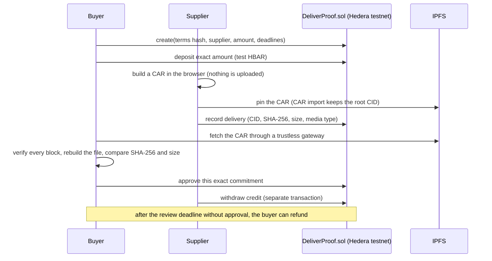

# DeliverProof

**Pay for a digital delivery only after the buyer has verified the exact bytes and explicitly approved them.** A Scaffold-HBAR template for Hedera testnet.

DeliverProof is an escrow for one buyer, one supplier and one file. The supplier publishes the file on IPFS and records a commitment on chain: the CID, SHA-256, size and media type. The buyer fetches the file from a public IPFS gateway, checks it in the browser against that commitment and then approves. Approval creates credit for the supplier. Withdrawal is a separate transaction. **Silence never releases money:** after the review deadline, the buyer can reclaim the deposit.

Anyone can check an agreement without a wallet. The verifier replays the contract's history from its public deployment, checks every event and receipt, and reads the stored state at one block. When the data it needs is missing it answers `inconclusive`. It never guesses a success.

> **Status: public source template; contract deployed on Hedera testnet.**
> Source `1b19cbf` passed the official CLI installation and validation on a
> GitHub-hosted runner ([run 36637995026](https://github.com/rafaorlando3/deliverproof/actions/runs/36637995026)).
> The deployment is confirmed on [Hashscan](https://hashscan.io/testnet/transaction/0x5eeeb8fd700bbc15fe538495a804e6048b40024fb83b0c0807738d573cfdd227).
> Both agreement paths, public IPFS retrieval and the HCS evidence trail are confirmed;
> see the [public evidence](#public-evidence) and [verification status](docs/STATUS.md).
> The shipped deployment manifest is `null`, so a fresh app shows a clearly labelled,
> disabled source preview until a reviewed manifest is installed.

## What you get

- **An escrow that pays only for approved bytes.** Exact deposit, explicit approval of the recorded commitment, credit-then-withdraw, and a buyer refund after the review deadline. No admin, no upgrades, no fees.
- **Browser-side IPFS verification.** The CAR archive is fetched from a public trustless gateway; every block is hashed, the file is rebuilt and compared by SHA-256 and size, with limits on size, blocks and time. Missing blocks, unreadable archives and unavailable gateways are `inconclusive`; root or content mismatches are reported separately and do not establish supplier intent.
- **A wallet-free verifier** (`verifyAgreement`) that answers `verified`, `mismatch` or `inconclusive` with a reason code.
- **Hedera details handled once** ([below](#hedera-details-handled-for-you)): tinybar versus 18-decimal RPC values, the 7-day log-range limit, historical reads at a fixed block, and EVM addresses.
- **A supplemental HCS evidence trail.** One canonical message per verified contract event, compared with the contract history by transaction hash and log index. The trail never changes the contract verdict. The public testnet topic accepts messages only from the operator's key and has no admin key; it is linked in the [evidence table](#public-evidence).
- **A deployment journal for unresolved attempts.** A preserved checkout blocks a new deployment while an earlier attempt is unresolved; read-only recovery helps reconcile a lost response. It does not coordinate separate runners.

## Why IPFS is load-bearing

DeliverProof pays for bytes, so the bytes have to be retrievable by anyone and checkable without trusting the supplier's server. Content addressing provides exactly that. The contract stores the CID and the SHA-256; the buyer's browser fetches the CAR from a public trustless gateway, verifies each block against its hash and rebuilds the file before the approve button means anything. In this template, IPFS provides content-addressed retrieval without selecting a supplier-controlled download URL. Removing it would require another retrieval mechanism and changes to the CID/CAR verification flow; a digest alone does not make the file publicly retrievable.

The app never uploads anything. It builds the CAR in the browser; the supplier pins it with any IPFS service that supports **CAR import and keeps the root CID** (a plain file upload may re-encode the file and change the CID). The protected testnet proof workflows in [deliverproof-testnet-proof](https://github.com/rafaorlando3/deliverproof-testnet-proof) are configured to pin through Filebase's IPFS RPC `dag/import` and confirm the root.

Hedera side: `DeliverProof.sol` is written for the Hedera EVM on testnet (chain 296); the app and the verifier reach it through the Hedera JSON-RPC relay (`testnet.hashio.io`).

## Quick start

Requirements:

- Node.js **22.22.2 with npm@10.9.7** is the recorded default. Declared ranges are 20.18.3–20.x, 22.18.0–22.x and 24.0.0–24.x; recorded results on 20.18.3 and 24.21.0 are in [STATUS](docs/STATUS.md). Node 20.18.3 prints `EBADENGINE` warnings from Vite and eslint-visitor-keys, which ask for 20.19.0 on that line.
- git with `user.name` and `user.email` set (the Scaffold-HBAR CLI checks this).

```sh
npm create scaffold-hbar@latest -- --template rafaorlando3/deliverproof
```

Select Next.js, Hardhat, testnet and the package manager npm. Then:

```sh
cd ⟨project-folder⟩
npm run check
npm run core:test
npm run hardhat:test
npm run next:build
npm run next:start
```

Open http://127.0.0.1:3000 (`npm run next:dev` for development). With the stock `null` manifest you see the disabled source preview. With a reviewed deployment manifest installed, enter an agreement number and press **Verify agreement**: the page shows the state, participants, deposit, snapshot block and checked event history without connecting a wallet. The public testnet contract is listed in the evidence table below. Agreements 1 (approval and supplier withdrawal) and 2 (refund and buyer withdrawal) have the public receipts below. The core verifier returned `verified` for both agreements in the public HCS run listed below; an app export and screenshot are not recorded. The template deliberately ships without the operational manifest.

The recorded public install used source `1b19cbfa5c37b832b540d2ac4eef8fd17834a10e`, CLI 0.4.1, Node 22.22.2 and npm@10.9.7, without secrets or a template override ([run 36637995026](https://github.com/rafaorlando3/deliverproof/actions/runs/36637995026)). Installation, all ten required validation commands and the production HTTP boot check passed. Core: 113 passed and 1 opt-in live mirror test skipped; contract: 38 passed; chain: 46 passed. These are recorded results for that source, not proof that future revisions passed. The CLI omits `template.json` and transforms the lockfile and package-manager metadata in three manifests; see [INSTALL](docs/INSTALL.md#external-scaffold-hbar-template-gate). The HTTP boot check does not exercise wallets or live Hedera, IPFS or HCS flows.

### Run the app against a local chain

No testnet account is needed. On chain 31337 the amounts are local accounting units, not Hedera currency behavior.

1. `npm run hardhat:compile`
2. `npm run hardhat:node` in a second terminal. It prints development keys at startup; do not save or share that output.
3. `npm run hardhat:deploy:local`
4. Review `packages/nextjs/lib/deployment.candidate.json`, then copy it to `packages/nextjs/lib/deployment.json`.
5. `npm run next:build` and `npm run next:start`, and use development accounts of the local node, never a personal wallet.

Details and limits: [local EVM rehearsal](docs/INSTALL.md#local-evm-rehearsal).

## How it works



States: `Draft → Funded → Submitted → Approved`, or `Funded/Submitted → Refunded`. Approved and Refunded each create one credit. Only `withdraw` pays it.

| Package | What it contains |
| --- | --- |
| `packages/hardhat` | `DeliverProof.sol` (no admin, no upgrades, no fees, reentrancy guard), contract tests, and a deployment script with an exclusive attempt journal and read-only recovery; uncertain attempts block another send |
| `packages/core` | Delivery commitment, CAR/UnixFS verification with limits, and the network verifier (`verifyAgreement`), which returns `verified`, `mismatch` or `inconclusive` with a reason code |
| `packages/nextjs` | The app: create, deposit, prepare the CAR, verify, record, approve or refund, withdraw, evidence export |

The full protocol, including the commitment encoding and limits, is in [docs/PROTOCOL.md](docs/PROTOCOL.md). The step-by-step workflow for both participants is in [docs/INSTALL.md](docs/INSTALL.md#workflow-and-file-availability).

## Hedera details handled for you

- **Units.** Solidity on Hedera sees tinybar (8 decimals). JSON-RPC `value` uses 18 decimals, so it is tinybar × 10^10. The app and the deploy script convert explicitly and never use floating point.
- **Log limits.** `eth_getLogs` refuses ranges over 7 days (`-32004`). The verifier reads history in 6-day windows. A result that is too large (`-32011`, mirror node pagination) counts as a failed read, which is reported as `inconclusive` and never as a partial history.
- **Addresses.** A contract created by an Ethereum transaction has an EVM address (not long-zero) in the receipt and in its logs. The verifier checks that address against the reviewed deployment.
- **History.** State is read at one fixed block with historical `eth_call`, and receipts are checked against the block hash from `eth_getBlockByNumber`.
- **Optional HCS cross-check.** The core can compare a protected topic with verified contract events, including transaction hash and log index. A message mined after the contract snapshot requires a fresh read. This supplemental check never changes the contract verdict; the core also includes an opt-in publisher and a testnet SDK adapter. The source template has no HCS UI integration. The protected HCS workflow in the separate proof repository created topic [0.0.10783135](https://hashscan.io/testnet/topic/0.0.10783135) and published one message per verified contract event of agreements 1 and 2 (11 messages); see the [public evidence](#public-evidence). See [the HCS protocol](docs/PROTOCOL.md#hcs-evidence-trail-supplemental).

These behaviors are covered by local tests; public relay samples from `testnet.hashio.io` concern third-party contracts. The public deployment, both agreement paths, IPFS retrieval and the HCS trail are recorded in [STATUS](docs/STATUS.md).

## Using the app with a wallet (testnet)

This route needs a deployment on Hedera testnet (yours, or a reviewed public one) and two test accounts.

1. Add Hedera testnet to an EVM wallet: RPC `https://testnet.hashio.io/api`, chain ID 296.
2. Get test HBAR for two test accounts (buyer and supplier) at the Hedera portal faucet.
3. Follow the workflow in [docs/INSTALL.md](docs/INSTALL.md#workflow-and-file-availability). Use public synthetic files only, up to 1 MiB.

Every transaction asks your wallet for confirmation. An unknown result locks
further sends in the current page session. Only evidence tied to the original
transaction can resolve it. If no original hash was returned, pasting a hash is
an independent observation and does not release the attempt. The lock is in
memory: reloading or opening another tab does not prove retrying is safe.
The app never automatically resends a transaction.

## Deploy your own copy

Deploying sends a real testnet transaction from your test account. The script's
**testnet mode** accepts only chain 296 at the fixed hashio endpoint; its local
mode uses chain 31337. Neither reads `.env` files.

| Variable | Value | When |
| --- | --- | --- |
| `DELIVERPROOF_TESTNET_AUTHORIZED` | `yes` | explicit opt-in, required to deploy to testnet |
| `DELIVERPROOF_TESTNET_PRIVATE_KEY` | test account key | set only in the protected environment of the process; never in a file, a command argument or a log |
| `DELIVERPROOF_RECOVERY_TX` | public transaction hash | only for `--recover-testnet`, when a deploy response was lost |

```sh
npm run hardhat:deploy:testnet
# review packages/nextjs/lib/deployment.candidate.json, then copy it to deployment.json
npm run next:build
```

If a deploy is interrupted, preserve its attempt journal and compiled artifact;
do not deploy again from this or a fresh checkout. Run
`node scripts/deploy.cjs --recover-testnet` from `packages/hardhat`. It only reads
the chain and never signs. Review the [recovery limits](docs/INSTALL.md#recovery-after-a-lost-deployment-response)
before accepting a candidate.

## Public evidence

Source installation, contract deployment, both agreement paths and the HCS trail have public evidence below. The delivered file is retrievable by CID from public IPFS gateways. An app export and screenshot of the verifier are not recorded. A queued run or submitted hash alone does not count.

| Required evidence | Current state |
| --- | --- |
| Public source repository | Done: https://github.com/rafaorlando3/deliverproof |
| Fresh external CLI installation on a clean runner | Done for source `1b19cbf`: [run 36637995026](https://github.com/rafaorlando3/deliverproof/actions/runs/36637995026), evidence artifact sha256 `e8277d94902130ca08b8b60382ab70b29bb05d28119bf8f77fdc0b8c590f3286` |
| Contract address, runtime hash and canonical deployment receipt | Confirmed: contract `0.0.10781121`, [Hashscan transaction](https://hashscan.io/testnet/transaction/0x5eeeb8fd700bbc15fe538495a804e6048b40024fb83b0c0807738d573cfdd227), [reviewed deployment manifest](https://github.com/rafaorlando3/deliverproof-testnet-proof/blob/7fbb6fc96a25d2ba549315ba64d3016ffbfaa4b2/packages/nextjs/lib/deployment.json) |
| First agreement creation and exact deposit (tinybar × 10^10 in RPC) | Confirmed: [create](https://hashscan.io/testnet/transaction/0x189592885e9552b49216c293ab14a08b09c8c270221cad6ae5a1733feeabc532), [deposit of 0.5 test HBAR](https://hashscan.io/testnet/transaction/0xaedc448179ac2a4cddd997e2ef9811410dc2d383360da9a72523d182b3a6b457) |
| Delivery commitment, preserved-root CID and public CAR retrieval | Confirmed: [submit](https://hashscan.io/testnet/transaction/0x176d23d3bca0fb0f80cd44e106d0e3e048be9994bc965e39e615f9912085307a) with CID `bafkreicmidb4okorv4g457l5pfygk6okbrbsgh2wtrj6qy3m645os7tjva` (101 bytes, SHA-256 `4c40c3c729d1af0dcefd7d79706579ca0c43231f569c53e8636cf73ae97e69a8`); [trustless CAR from ipfs.io](https://ipfs.io/ipfs/bafkreicmidb4okorv4g457l5pfygk6okbrbsgh2wtrj6qy3m645os7tjva?format=car) and [file from the Filebase gateway](https://ipfs.filebase.io/ipfs/bafkreicmidb4okorv4g457l5pfygk6okbrbsgh2wtrj6qy3m645os7tjva) |
| Buyer approval and separate supplier withdrawal receipts | Confirmed: [approve](https://hashscan.io/testnet/transaction/0x4c683f724872cc56633d1679590d0645c96edc5af23ce5bf25f466eb127f94a1) of commitment `0x5a3f068179260a6ccb5f25dffa82b847e911949273567068dc4749b5a4d6ed13`, [supplier withdrawal](https://hashscan.io/testnet/transaction/0x848ba756e9046af24bc7b7df8790f2e9100123378eff63ab747d66aa60fe1707) |
| Second agreement refund and separate buyer withdrawal receipts | Confirmed: [create](https://hashscan.io/testnet/transaction/0x4899bf3759415a0d81f1361c67c4de4722b9ea418a46cb43e2accc7d68d54f97), [deposit of 0.3 test HBAR](https://hashscan.io/testnet/transaction/0xae11b725a25a77c7e4b473197c06efb4ad024a17475ad63844cb449fd50446a1), [refund after the review deadline](https://hashscan.io/testnet/transaction/0x14660c459c7d79d6f3612d5234aab3bbab99d192dbd14a83eabcf39df2e93411), [buyer withdrawal](https://hashscan.io/testnet/transaction/0x9e739a18ce4ebf3de402684ed267c9b3d1659db5384080547a83ad9567324930) |
| HCS evidence trail, read from the mirror node | Confirmed: topic [0.0.10783135](https://hashscan.io/testnet/topic/0.0.10783135) with the operator's submit key and no admin key ([creation](https://testnet.mirrornode.hedera.com/api/v1/transactions/0.0.10776776-1790719954-377000000)); 11 messages, one per contract event of agreements 1 and 2, published by [run 36640306565](https://github.com/rafaorlando3/deliverproof-testnet-proof/actions/runs/36640306565); [messages on the mirror node](https://testnet.mirrornode.hedera.com/api/v1/topics/0.0.10783135/messages) |
| Verifier observation for the same agreements | Recorded in CI: the HCS step compares a topic only after the core verifier returns `verified`, and it reported a consistent trail for agreements 1 and 2 in [run 36640306565](https://github.com/rafaorlando3/deliverproof-testnet-proof/actions/runs/36640306565). An app export and screenshot are not recorded. |

The completed [proof workflow run 36636649271](https://github.com/rafaorlando3/deliverproof-testnet-proof/actions/runs/36636649271) resumes the same proof after a nonce-read guard stopped the first attempt. It preserves the earlier transaction hashes and sends only the remaining buyer withdrawal. All assets and amounts are synthetic/testnet.

## Tests

| Suite | Command | What it checks |
| --- | --- | --- |
| Core (vitest) | `npm run core:test` | Commitments, CAR limits and tampering, verifier result codes, log windows, HCS checks and publisher error handling |
| Contract (Hardhat) | `npm run hardhat:test` | Deadlines, exact deposit, credit and withdrawal, reentrancy, the liability invariant, deploy journal and recovery |
| Chain (vitest and a local node) | `npm run chain:test` | Solidity and TypeScript commitment vectors, reorgs, missing logs, wrong contract, unit scaling, read failures and HCS snapshot races |

Also run `npm run next:lint` (zero warnings allowed), `npm run next:check`, `npm run next:build` and `npm run format:check`. Current counts and the public CI run are in [docs/STATUS.md](docs/STATUS.md).

## Limits

- Testnet only. There is no mainnet configuration. Each agreement holds at most 10 test HBAR.
- Byte verification establishes correspondence to the recorded commitment. It does not establish authorship, quality, recipient acceptance or when the recipient obtained the file.
- A CID does not guarantee continuing availability. Preserve the CAR and keep it pinned; successful offline verification is not public IPFS availability.
- There is no arbitration. Silence never pays the supplier; the buyer can refund after the review deadline even if a file was submitted.
- Direct EOA participants only; general smart-wallet/forwarding-contract support is not claimed.
- The deployment journal protects one preserved checkout. Storage durability and real-network recovery still need their documented acceptance checks.
- ESLint 9.39.5 is a temporary unsupported development-tool exception; see [the replacement requirement](docs/STATUS.md#known-limits).

## AI-assisted development

This template was developed with assistance from Claude and Codex. Its public history records the changes and validation evidence.

See [AGENTS.md](AGENTS.md) for the invariants and checks an AI coding assistant must follow in this project.

## License

MIT. Original work. The official Scaffold-HBAR layout and manifest format were followed for compatibility. Sources: [docs/SOURCES.md](docs/SOURCES.md).
